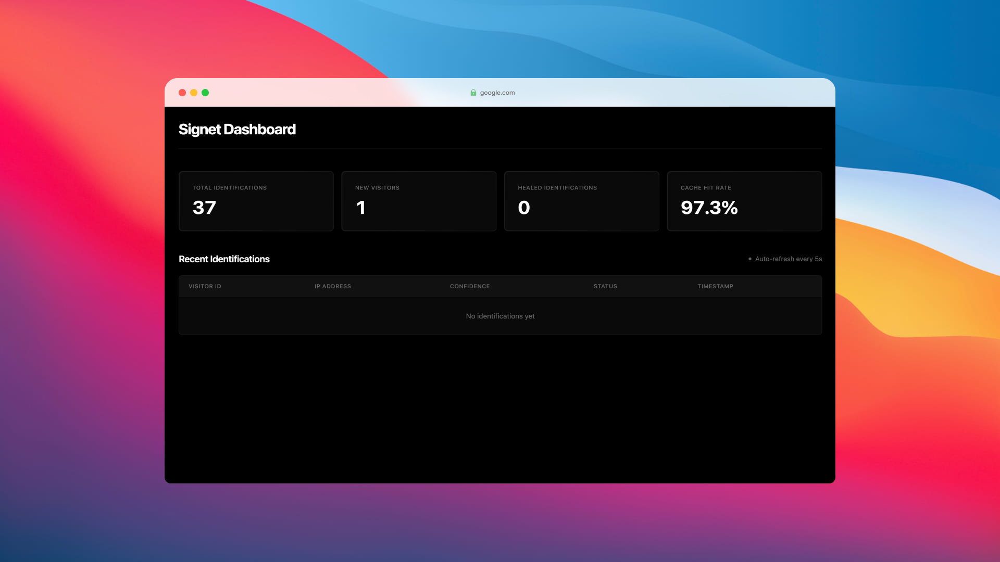

> ⚠️ This project is in an early experimental stage and is under active development. Features may be incomplete, unstable, or subject to breaking changes at any time. It is not production-ready and should not be used in production environments.

# signet

Self-hosted hi-fi browser fingerprinting that just works. Signet is a research-backed engine that generates stable Visitor IDs by aggregating 40+ granular signals—including Canvas2D, WebGL, and WASM timings (soon). It uses a self-healing matching algorithm ($\ge 0.75$ Jaccard similarity) to maintain persistence across browser updates and privacy defenses.




## Quick Start

```bash
git clone https://github.com/iamgideonidoko/signet.git && cd signet
cp .env.example .env
make docker-up
make migrate
npx live-server --host=localhost --port=3000 --open=demo/index.html
```

Demo: http://localhost:3000/demo/index.html

Dashboard: http://localhost:6969/dashboard

## How It Works

```
Browser (TS Agent) → Go API → Redis Cache → Similarity Engine → PostgreSQL
                                    ↓
                            visitor_id + confidence
```

**Algorithm:**

1. Compute SHA-256 hardware hash (canvas + audio + webgl)
2. Check Redis cache → HIT: return visitor_id | MISS: continue
3. Query DB for candidates in same /24 subnet
4. Calculate weighted Jaccard similarity (≥0.75 threshold)
5. Match found: reuse visitor_id (healed) | No match: create new
6. Cache for 48h, return response

## Use Cases

- **Fraud Detection:** Track users across cookie clearing and incognito mode
- **A/B Testing:** Consistent bucketing without cookies
- **Analytics:** Accurate unique visitors (survives deletion)
- **Paywall/Rate Limiting:** Enforce limits by device fingerprint
- **User Recognition:** Identify returning users without login

## Usage

**Client:**

```html
<script src="https://fp.your-domain.com/agent.js"></script>
<script>
  Signet.identify("https://fp.your-domain.com/v1/identify").then((result) => {
    console.log(result.visitor_id, result.confidence, result.is_new);
  });
</script>
```

**API:**

```bash
POST /v1/identify
{
  "signals": {
    "canvas_2d_hash": "...",
    "audio_hash": "...",
    "webgl_vendor": "...",
    ...
  }
}

# Response
{
  "visitor_id": "uuid",
  "confidence": 0.95,  # ≥0.75 = healed match
  "is_new": false,
  "request_id": "uuid"
}
```

**Endpoints:**

- `GET /health` - Health check
- `GET /metrics` - Prometheus metrics
- `GET /dashboard` - Analytics UI
- `GET /agent.js` - Agent script
- `GET /agent.js.map` - Agent script source map

## Development

**Stack:** Go 1.25+, Fiber, PostgreSQL 15+, Redis 7+, TypeScript (zero deps)

```bash
make install  # Install dependencies
make build    # Build API + Agent
make test     # Run tests
make dev      # Start dev mode (requires air)
```

## Contributing

Take a look at the roadmap. Priority areas include Fingerprinting techniques, performance optimization, security audits, ML similarity scoring.

## Roadmap

**Matching Algorithm:**

- [x] Weighted Jaccard similarity with hardware (0.8), environment (0.5), software (0.2) weights
- [x] Threshold-based linking (≥0.75) for self-healing across browser updates
- [x] Visitor ID stability with 48h Redis cache
- [ ] Adaptive weight learning based on signal stability
- [ ] Multi-threshold cascading (0.75/0.85/0.95 confidence levels)

**Signal Collection:**

- [x] Canvas 2D rendering with gradient/text and SHA-256 pixel hashing
- [x] Audio context oscillator fingerprinting with FFT frequency data
- [x] WebGL vendor/renderer extraction and GPU parameters
- [x] Hardware concurrency (CPU core count)
- [x] Font detection (26 fonts tracked)
- [x] Color gamut and HDR capability detection
- [x] Challenge-response canvas for device authentication
- [x] Cross-site tracking detection (same fingerprint across domains)
- [ ] Canvas farbling/randomization detection
- [ ] Cross-session canvas stability tracking
- [ ] Multi-canvas verification for higher confidence
- [ ] Statistical defense fingerprinting (identify browser/extension anti-FP techniques)

**Privacy & Compliance:**

- [x] IP anonymization via /24 subnet masking (GDPR)
- [x] Privacy-by-design principles (minimal data collection)
- [x] GDPR-compliant storage and processing
- [ ] Clearable fingerprint state (user controls to reset data)
- [ ] Fingerprint budget API (limit entropy per origin)
- [ ] Detectability indicators (notify users of fingerprinting)
- [ ] Do Not Track respect

**Infrastructure:**

- [x] Redis caching with token bucket rate limiting
- [x] Bot detection (6 heuristics: webdriver, headless, automation APIs)
- [x] PostgreSQL storage with hardware hash indexing

**Entropy & Uniqueness Scoring:**

- [ ] Shannon entropy calculation per signal: H(X) = -Σ P(xi) log₂ P(xi)
- [ ] Demographic-adjusted uniqueness scoring by geography
- [ ] Joint entropy computation: H(X,Y) vs H(X) + H(Y) for correlation
- [ ] Conditional entropy for information gain measurement
- [ ] Population-based uniqueness percentiles ("More unique than X%")
- [ ] Invasiveness classification (low/medium/high entropy thresholds)
- [ ] Per-signal bits of entropy reporting
- [ ] Demographic segmentation (country/region-specific analysis)
- [ ] Entropy stability tracking over time/geography
- [ ] Attribute correlation detection (OS-browser version pairing)

**Signal Stability & Evolution:**

- [ ] Longitudinal fingerprint analysis (weeks/months tracking)
- [ ] Attribute persistence metrics per signal
- [ ] Cross-update resilience scoring (survive browser updates)
- [ ] Shadow fingerprinting (secondary fingerprints for resilience)
- [ ] Signal stability scoring (which attributes persist over time)
- [ ] Fingerprint degradation tracking (how fingerprints decay)
- [ ] Historical fingerprint database (evolution history per visitor)
- [ ] Cross-session canvas stability monitoring
- [ ] Canvas consistency scoring for same-device detection
- [ ] Taint tracking for fingerprint leakage detection
- [ ] Third-party vs first-party script analysis

**CSS-Based Fingerprinting:**

- [ ] CSS calc() fingerprinting (browser-specific math differences)
- [ ] Font metrics via CSS layout (no JavaScript required)
- [ ] CSS selector support detection
- [ ] CSS property support testing
- [ ] Container query fingerprinting
- [ ] CSS animation timing differences
- [ ] Media query probing (detailed screen/device capabilities)
- [ ] CSS-only tracking (97.95% distinction rate, no JS)
- [ ] Rendering quirks detection (browser-specific layout)

**WebAssembly Timing:**

- [ ] WASM performance timing for CPU microarchitecture detection
- [ ] SIMD instruction detection and performance
- [ ] Memory operations profiling (bulk memory, threading, shared buffers)
- [ ] IEEE 754 floating-point quirks
- [ ] Exception handling timing patterns
- [ ] Instruction-level timing (CPU-specific execution)
- [ ] WASM feature detection (10+ unique signals)

**Behavioral Interaction Tracking:**

- [ ] Mouse movement patterns (trajectory, speed, acceleration)
- [ ] Keyboard timing analysis (keystroke dynamics)
- [ ] Scroll behavior tracking (speed, smoothness)
- [ ] Touch gesture fingerprinting (pressure, size, multi-touch)
- [ ] Click pattern analysis (timing, precision)
- [ ] Hover behavior tracking (duration, patterns)
- [ ] Real-user interaction triggers (fingerprint on genuine events, not page load)
- [ ] ML-based human vs bot behavioral classification
- [ ] Event timing fingerprinting (browser-specific latencies)

**Ad Targeting Correlation:**

- [ ] Ad targeting correlation (link fingerprints to ad bidding)
- [ ] Tracking proof framework (causal evidence for ad targeting)
- [ ] Fingerprint-to-ad mapping (attribute correlation with ad delivery)
- [ ] A/B testing with fingerprints (controlled experiments)
- [ ] Third-party tracker chains (map fingerprint sharing across ad networks)
- [ ] Real-time bidding analysis (correlate fingerprints with RTB auctions)
- [ ] CanvasDict spoofing protection (defense against CRSlash attacks)
- [ ] Multi-canvas verification for authentication

**ML & Adaptive Learning:**

- [ ] Neural network for similarity prediction (hybrid with static Jaccard)
- [ ] Continual learning for drift adaptation

**Advance Infra:**

- [ ] WebSocket streaming for real-time identification
- [ ] Geo-enrichment (IP → location with MaxMind/IP2Location)
- [ ] Prometheus metrics expansion

## License

[MIT](LICENSE)

## Support

[Issues](https://github.com/iamgideonidoko/signet/issues)

## Reference papers

- [ThresholdFP: Enhanced Durability in Browser Fingerprinting (2025)](https://research.sabanciuniv.edu/52205/1/ThresholdFP.pdf)
- [How Unique is Whose Web Browser? The Role of Demographics in Browser Fingerprinting (Google 2024)](https://arxiv.org/pdf/2410.06954)
- [Browser Fingerprinting Using WebAssembly (2025)](https://arxiv.org/pdf/2506.00719)
- [Cascading Spy Sheets: Exploiting the Complexity of Modern CSS for Email and Browser Fingerprinting (NDSS 2025)](https://publications.cispa.de/articles/conference_contribution/Cascading_Spy_Sheets_Exploiting_the_Complexity_of_Modern_CSS_for_Email_and_Browser_Fingerprinting/27194472)
- [Beyond the Crawl: Unmasking Browser Fingerprinting in Real User Interactions (WWW 2025)](https://arxiv.org/pdf/2502.01608)
- [The First Early Evidence of the Use of Browser Fingerprinting for Online Tracking (FPTrace, 2025)](https://arxiv.org/pdf/2409.15656)
- [Mitigating Browser Fingerprinting in Web Specifications (W3C 2024)](https://www.w3.org/TR/fingerprinting-guidance/)
- [Fingerprinting and Tracing Shadows: The Development and Impact of Browser Fingerprinting (SECURWARE 2024)](https://www.thinkmind.org/articles/securware_2024_2_160_30065.pdf)
- [Breaking the Shield: Analyzing and Attacking Canvas Fingerprinting Defenses in the Wild (WWW 2025)](https://www.hoangdainguyen.com/publications/canvas_fp_attack_www25.pdf)
- [Dual Study of Canvas Fingerprinting Based Authentication: A Novel Spoofing Attack and the Countermeasure (ICDCS 2024)](https://nsaxena.engr.tamu.edu/wp-content/uploads/sites/238/2025/08/Dual_Study_of_Canvas_Fingerprinting_Based_Authentication_A_Novel_Spoofing_Attack_and_the_Countermeasure.pdf)
- [FP-tracer: Fine-grained Browser Fingerprinting Detection via Taint-tracking and Entropy-based Thresholds (PoPETs 2024)](https://petsymposium.org/popets/2024/popets-2024-0092.pdf)
